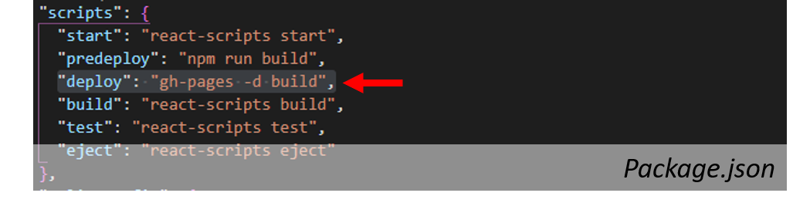

# Velkommen til CICD Kurs med Norkart!
Målet med dette kurset er å vise hvordan du kan raskt få en kart-webapplikasjon til å kjøre live. Ved å få appen raskt ut i produksjon og ved å videreutvikle den med 'Continuous Integration' og 'Continuous Delivery' (CICD) prinsippet, kan nye features og bug-fixes effektivt og kontinuerlig integreres i appen din. Her får du en enkel mal på en React applikasjon med et mapbox kart. Denne skal du deploye til github pages slik at dere lett kan vise andre det kule dere lager.

Når dere er ferdige her skal dere ha deres egen lenke til en live react kart-nettside slik som dette: https://norkart.github.io/webkurs2020-CICD-React/.

---

## STEG 0: Forutsetninger
Før dere starter må dere ha noe programvare installert:

1. **Git**. Følg instruksjonene som gjelder for ditt OS her: https://git-scm.com/book/en/v2/Getting-Started-Installing-Git. Sjekk at git er instalert: 
 ```
    git --version
 ```

2. **Github**. Lag deg en bruker her https://github.com/


3. **Node.js med npm**. Det annbefales å bruke node version manager for å installere node siden dette lar deg enkelt bytte mellom node versjoner. For **Windows**: https://docs.microsoft.com/en-us/windows/nodejs/setup-on-windows. For **Mac/Linux**: 
https://www.stanleyulili.com/node/how-to-install-node-and-npm-on-mac-or-linux/. Sjekk at node og npm er installert: 
 ```
    node --version
 ```

```
    npm --version
```

4. **En code editor (vs code annbefales)**. https://code.visualstudio.com/download


---


## STEG 1: Klon og kjør Prosjektet
1. I terminalen. Finn fram til fillokasjonen hvor dere vil lagre prosjektet og klon dette repoet:

```
   git clone https://github.com/Norkart/webkurs2020-CICD-React.git
```

2. Installer npm pakkene til prosjektet. De relevante pakkene kan sees i `package.json` filen i prosjektet. Vi bruker for eksempel `mapbox-gl` biblioteket til å vise kart på netsiden. Dette vil i tillegg installere `gh-pages`som brukes til å deploye nettsiden.
```
   npm install
```

3. Kjør opp prosjektet lokalt:
```
   npm start
```
Dette bør åpne browseren din på http://localhost:3000/react-bedpress.

HURRA! Du kan nå kalle deg for en React-utvikler!

---

## STEG 2 Push koden til ditt eget github repo

Du har nå en enkel mal som du kan bygge videre på. For å begynne å jobbe videre med prosjektet og for at du skal kunne deploye til din egen github-pages, trenger du å flytte koden over på ditt eget github repository. 

1. Lag deg et nytt repository på https://github.com/. Gjerne kall repositoriet **webkurs2020-CICD-React**. Velg public (hvis du har github pro (gratis for studenter) kan du velge å gjøre repoet private. Hvis ikke må det være public for at github-pages skal virke). Ikke initialiser med README, .gitignore eller licence.


2. I terminalen. Sørg for at du er inni prosjektet som du klonet og kjørte i forrige steg. `ctrl c`for å stoppe appen hvis den fortsatt kjører. 

3. Endre git 'origin' til dit nye repository:

```
   git remote set-url origin http://github.com/{{YOUR_GITHUB_USERNAME}}/{{YOUR_REPO_NAME}}
```

4. Dytt koden opp til ditt repository:
```
   git add .
   git commit -m'initial commit'
```
(Github har endret navnet på det som tidligere het 'master' til 'main')
```
   git push origin main
```
Koden din skal nå være 'pushet' til ditt nye repo.

---

## STEG 3 Få nettsiden til å kjøre på github-pages.

1. Åpne prosjektet i vs code. (skriv `code .` i terminalen ) 
2. Endre homepage i `package.json` til din egen url: `"homepage": "http://{{YOUR_GITHUB_USERNAME}}.github.io/{{YOUR_GITHUB_PROJECT}}",`


3. Deploy appen til github pages:
```
   npm run deploy
```
Denne kommandoen vil lage en branch i repoet ditt som heter gh-pages. Du kan kjøre denne kommandoen siden kildekoden har definert den i scripts i package.json. I tillegg, har du allerede installert pakken `gh-pages` når du kjørte kommandoen `npm install`. 



4. Aktiver github pages i github repoet ditt. Gå til settings og skroll ned til GitHub pages section. Velg source `gh-pages`


5. Sjekk om nettsiden din kjører på: `http://{{YOUR_GITHUB_USERNAME}}.github.io/{{YOUR_GITHUB_USER}}`

Hurra! nettsiden din er live :D


## STEG 4 utvikle en super cool react-app med continuous deployment!

1. Gjør endringer i koden
2. Push oppdateringene dine til git

```
git add .
git commit -m 'Your commit message'
git push origin main
npm run deploy
```

Endringene du gjør vil automatisk oppdateres på nettsiden din! Happy coding :D

---
### NB
- Mapbox tokenet til dette prosjektet vil utløpe etter et par uker. Du kan enkelt lage din egen token på https://account.mapbox.com/access-tokens. Det er gratis helt frem til du får veldig stor traffikk mot appen din. Bytt ut tokenen din i,'.env' filen for å ta i bruk din egen token. Det annbefales ikke å legge tokenet i kode på et public github repo (bruk private eller la være å pushe .env fila til git). I Mapbox Studio kan du også lage custom kart (f.eks dark mode med rosa vann) som du kan vise på nettsiden.
