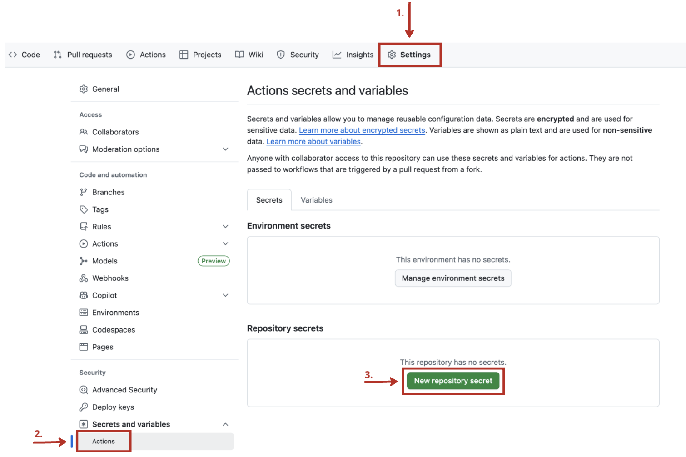

# Velkommen til workshop med Norkart!

Vi gir dere en enkel fremgangsmåte på å sette opp en React-applikasjon med et Maplibre-kart. Deretter skal dere utvide kartfunksjonaliten til applikasjonen. Her kan dere velge mellom tre ulike oppgaver. Tilslutt rekker dere kanskje å deploye applikasjonen til GitHub Pages. 

Videre kan dere:

- Sette opp automatisk utrulling ved bruk av GitHub Actions
- Utvikle enda mer funksjonalitet i appen

Still spørsmål dersom noe var uklart😆

Lykke til!

---

## STEG 0: Forutsetninger

Før dere starter må dere ha noe programvare installert (installer kun det dere ikke har fra før):


1. **Git**. Følg instruksjonene som gjelder for ditt OS her: https://git-scm.com/book/en/v2/Getting-Started-Installing-Git. Sjekk at git er installert:

```
   git --version
```

2. **Github**. Lag deg en bruker her https://github.com/

3. **Node.js med npm** https://nodejs.org/en/download

Sjekk at du har fått installert node med npm!
```
   node --version
```

```
    npm --version
```

4. **En code editor (vs code anbefales)**. https://code.visualstudio.com/download

---

## STEG 1: Fork, clone og kjør prosjektet

1. For å få din egen versjon av prosjektet under egen GitHub-bruker fork'er du dette prosjektet. Dette gjøres ved å trykke `fork` oppe i høyre hjørnet.
   Behold default innstillinger.

2. I terminalen. Finn fram til fillokasjonen hvor dere vil lagre prosjektet og klon repoet (deres egen versjon av prosjektet som dere nettopp forket):

```
   git clone https://github.com/<YOUR_GITHUB_USERNAME>/norkart-webkurs-CICD-React.git
```

3. Åpne VSCode og åpne prosjektet du nettopp clonet.


4. Åpne ny terminal. Installer npm pakkene til prosjektet. De relevante pakkene kan sees i `package.json` filen i prosjektet. Vi bruker for eksempel `maplibre-gl` biblioteket til å vise kart på nettsiden. Dette vil i tillegg installere `gh-pages` som brukes til å deploye nettsiden.

```
   npm install
```

5. Kjør opp prosjektet lokalt:

```
   npm run dev
```

Dette bør åpne browseren din på http://localhost:5173/react-bedpress/.

HURRA! Du kan nå kalle deg for en React-utvikler!

---
## STEG 2: Legg til kartfunksjonalitet 

Velg **én** av oppgavene under. Etter at du har gjort en av oppgaven under, kan du gå virdere til å deploye applikasjonen på GitHub Pages. 

### OPPGAVE 1: Følg tutorialen til Maplibre og legg til flere funksjoner i appen

Gjerne ta utgangspunkt i [Maplibre sin torturial](https://maplibre-react-components.pentatrion.com/tutorial) for å legge til flere funksjoner i appen.
*ℹ️ Husk at vi bruker typeScript og ikke javascript, så du må kanskje gjøre noen små endringer på koden i tutorialen for at det skal funke. Spør gjerne om hjelp!*

### OPPGAVE 2: Legg til tegneverktøy i kartet

Legg til komponenten DrawComponent som en child av MapLibreMap i MapLibreMap.tsx.
Har tatt utganspunkt i [dette Maplibre eksempelet](https://maplibre.org/maplibre-gl-js/docs/examples/draw-geometries-with-terra-draw/) for å lage denne React komponenten.

### OPPGAVE 3: Lek deg med kartdata

Her kan man gjøre noe helt annet eller noe som bygger på oppgavene over. Dette er gjerne oppgave man starter på dersom man er godt kjent med React eller er blitt ferdig med en av de andre oppgavene over. Forslag kan være å bygge på en av de tidligere oppgavene man har fullført, prøve å kombinere noen oppgaver eller finne på noe helt annet.

Tips til andre ting du kan gjøre med kartet:

- Sjekk ut maplibre gl sine eksempler: http://maplibre.org/maplibre-gl-js/docs/examples/
- Visualisere historiske Oslo bysykkel data: https://oslobysykkel.no/en/open-data/historical
- Lag et Koropletkart av Norgesbefolkning. En Json fil er lagt ved (se sample_data folderen) som viser norges befolkning delt opp i 5x5km ruter.
- Visualiser din egen data. Du kan lage geojson filer her: https://geojson.io/#map=2/20.0/0.0


## STEG 3: Få nettsiden til å kjøre på GitHub Pages.

Etter å ha lagt til kartfunksjonalitet kan du deploye applikasjonen på en offentlig nettaddresse.

1. Åpne prosjektet i vs code. (skriv `code .` i terminalen )
2. Endre homepage i `package.json` til din egen url: `"homepage": "https://<YOUR_GITHUB_USERNAME>.github.io/norkart-webkurs-CICD-React",`
   

3. Aktiver GitHub Actions i repoet ditt


4. Deploy appen til GitHub Pages:

```
   npm run deploy
```

Denne kommandoen vil lage en branch i repoet ditt som heter gh-pages. Du kan kjøre denne kommandoen siden kildekoden har definert den i scripts i package.json. I tillegg, har du allerede installert pakken `gh-pages` når du kjørte kommandoen `npm install`.


5. Sjekk at GitHub Action 'pages-build-deployment' kjører


6. Når GitHub Action er ferdig - sjekk om nettsiden din kjører på: `https://<YOUR_GITHUB_USERNAME>.github.io/norkart-webkurs-CICD-React/`

Hurra! nettsiden din er live :D

## STEG 4: Automatisk deploy med GitHub Actions

For å oppdatere nettsiden må vi manuelt kjøre `npm run deploy` etter å ha endret koden. Heldigvis er dette mulig å automatisere. 

I stedet for å manuelt kjøre `npm run deploy`, kan vi bruke GitHub Actions til å automatisk deploye alle endringer som pushes til main-branchen. Dette vil spare oss for et manuelt steg.

1. Generer access token for å deploye nettsiden gjennom GitHub Actions

For å gi GitHub Actions tilgang til å lese og deploye repoet vårt, trenger vi ett access token. Gå til https://github.com/settings/tokens og trykk 'Generate new token', velg 'Classic'
<br>
<br>


<br>
<br>

Gi tokenet et navn, f.eks 'deploy-access', og huk av på 'repo'. Klikk så på 'Generate token' og kopier verdien.


<br>
<br>
<br>

2. Lag en secret som kan brukes av GitHub Actions

For å la GitHub Actions hente tokenet vi nettopp lagde, trenger vi en secret. Trykk på 'New Secret'. Gi den navn: 'ACTIONS_DEPLOY_ACCESS_TOKEN', og verdi: tokenet du kopierte fra forrige steg.
<br >
<br >
<br >

<br>
<br>
<br>

3. Gjør endring i appen og push til main branchen. Dette skal trigge en GitHub Action (se '.github\workflows\main.yml' ) som automatisk kjører `npm run deploy`. Når denne actionen er ferdig, skal dette trigge pages-build-deployment workflowen og endringene skal automatisk rulles ut til nettsiden din.

## STEG 5: Utvikle en super cool react-app med continuous deployment!


1. Velg en av de andre oppgavene under **STEG 2**
2. Push oppdateringene dine til git og deploy endringene

```
git add .
git commit -m 'Your commit message'
git push origin main
```

Endringene du gjør vil automatisk oppdateres på nettsiden din! Happy coding :D
Nå står du fritt til å gjøre noe det du vil med appen, mulige utfordringer:


