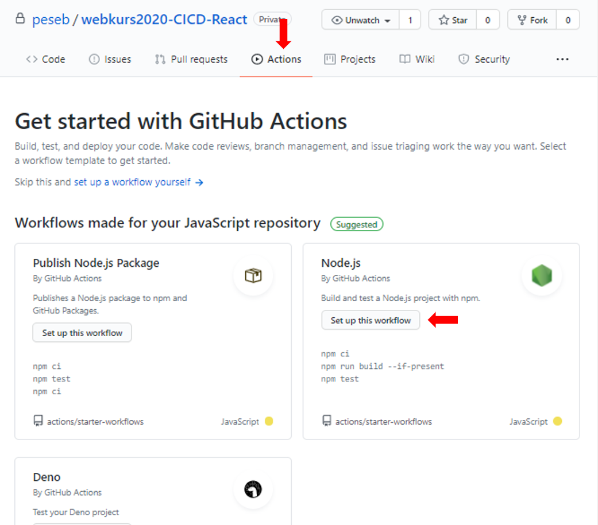

# Velkommen til Konkurranse med Norkart!

Dette er en konkurranse i regi av IT-Dagene 2021. Konkurransen er enkel. Målet er å lage den kuleste/fineste/morsomste/nyttigste kart-appen og deploye den (for eksempel på github-pages).
Vi gir dere en enkel boilerplate på en react-applikasjon med mapbox kart og forklarer hvordan denne kan deployes. Dere kan velge om dere ønsker å ta dette som utgangspunkt. Resten er opp til dere.

## Hvordan Delta
Send epost med lenke til appen du har laget og en kort beskrivelse av hva du har laget. Alle som deltar, vil bli kontaktet på mail etter fristen har gått ut og vinneren (Juryen's choice) annonseres på mail. Det blir så klart premie! 

- **Frist for å sende innslag:** Tirsdag 19. Januar 2021 23:59
- **Sendes til:** kari.meling.johannessen@norkart.no
- Hvis du foretrekker å kode med et annet front-end bibliotek (eg. Vue, Angular, vannila JS/HTML/css) eller et annet kart-bibliotek (e.g Leaflet, deck.gl) så er det helt greit men appen bør involvere kart.
- Dere kan gjerne jobbe i grupper. Bare skriv kontaktinformasjon til alle gruppemedlemmene i mailen.
- Denne konkurransen er basert på et kurs vi tidligere har holdt med linjeforeningene Abakus og Hybrida. Dersom du deltok på kurset, kan du gjerne bygge videre på det du gjorde da.

Lykke til!

Resten av denne READMEen forklarer hvordan du kan raskt få en boilerplate kart-webapplikasjon live. Ved å få appen raskt ut i produksjon og ved å videreutvikle den med 'Continuous Integration' og 'Continuous Delivery' (CICD) prinsippet, kan nye features og bug-fixes effektivt og kontinuerlig integreres i appen din og du kan enkelt vise frem til andre hva du har laget.

---

## STEG 0: Forutsetninger

Før dere starter må dere ha noe programvare installert:

1. **Git**. Følg instruksjonene som gjelder for ditt OS her: https://git-scm.com/book/en/v2/Getting-Started-Installing-Git. Sjekk at git er installert:

```
   git --version
```

2. **Github**. Lag deg en bruker her https://github.com/

3. **Node.js med npm**. Det annbefales å bruke node version manager for å installere node siden dette lar deg enkelt bytte mellom node versjoner. For **Windows**: https://docs.microsoft.com/en-us/windows/nodejs/setup-on-windows. For **Mac/Linux**:
   https://www.stanleyulili.com/node/how-to-install-node-and-npm-on-mac-or-linux/. Sjekk at node og npm er installert:

```
   node --version
```

```
    npm --version
```

4. **En code editor (vs code annbefales)**. https://code.visualstudio.com/download

---

## STEG 1: Fork, clone og kjør prosjektet

1. For å få din egen versjon av prosjektet under egen github-bruker fork'er du dette prosjektet. Dette gjøres ved å trykke `fork` oppe i høyre hjørnet.
Behold default innstillinger.

2. I terminalen. Finn fram til fillokasjonen hvor dere vil lagre prosjektet og klon repoet (deres egen versjon av prosjektet som dere nettop forket):

```
   git clone https://github.com/{{YOUR_GITHUB_USERNAME}}/norkart-webkurs-CICD-React.git
```

3. Gå inn i mappen du nettop klonet:

 ```
  cd norkart-webkurs-CICD-React/
 ```


4. Installer npm pakkene til prosjektet. De relevante pakkene kan sees i `package.json` filen i prosjektet. Vi bruker for eksempel `mapbox-gl` biblioteket til å vise kart på nettsiden. Dette vil i tillegg installere `gh-pages` som brukes til å deploye nettsiden.

```
   npm install
```

5. Kjør opp prosjektet lokalt:

```
   npm start
```

Dette bør åpne browseren din på https://localhost:3000/react-bedpress.

HURRA! Du kan nå kalle deg for en React-utvikler!

---

## STEG 2: Få nettsiden til å kjøre på github-pages.

1. Åpne prosjektet i vs code. (skriv `code .` i terminalen )
2. Endre homepage i `package.json` til din egen url: `"homepage": "https://{{YOUR_GITHUB_USERNAME}}.github.io/norkart-webkurs-CICD-React",`
   

3. Deploy appen til github pages:

```
   npm run deploy
```

Denne kommandoen vil lage en branch i repoet ditt som heter gh-pages. Du kan kjøre denne kommandoen siden kildekoden har definert den i scripts i package.json. I tillegg, har du allerede installert pakken `gh-pages` når du kjørte kommandoen `npm install`.


4. Aktiver github pages i github repoet ditt. Gå til settings og skroll ned til Pages section. Velg source `gh-pages`


5. Sjekk om nettsiden din kjører på: `https://{{YOUR_GITHUB_USERNAME}}.github.io/norkart-webkurs-CICD-React/`

Hurra! nettsiden din er live :D

## STEG 3: Utvikle en super cool react-app med continuous deployment!

1. Gjør endringer i koden (start for eksempel med å oppdatere kartets zoom nivå, start koordinater eller bakgrunnskart).
2. Push oppdateringene dine til git og deploy endringene

```
git add .
git commit -m 'Your commit message'
git push origin main
npm run deploy
```

Endringene du gjør vil automatisk oppdateres på nettsiden din! Happy coding :D
Videre gir vi deg 2 mulige utfordringer med fasit og nærmere instruksjoner. Men du står fritt til å gjøre noe helt annet hvis du har en kul ide til appen. Mulige utfordringer:

1. OPTION 1: Set opp automatisk deploy av appen trigget når main branchen oppdaterses.
2. OPTION 2: Lag en meny komponent for å bytte bakgrunnskart.

Tips til andre ting du kan gjøre med kartet:
- Sjekk ut mapbox gl sine eksempler: https://docs.mapbox.com/mapbox-gl-js/example/
- Visualisere historiske Oslo bysykkel data: https://oslobysykkel.no/en/open-data/historical
- Lag et Koropletkart av Norgesbefolkning. En Json fil er lagt ved (se sample_data folderen) som viser norges befolkning delt opp i 5x5km ruter.
- Visualiser din egen data. Du kan lage geojson filer her: https://geojson.io/#map=2/20.0/0.0


## OPTION 1: Automatisk deploy av app

For å oppdattere nettsiden må vi manuelt kjøre **npm run deploy** etter å ha endret koden. Hadde det ikke vært greit å automatisert dette slik at nettsiden oppdatteres hver gang main-branchen oppdateres? Dette kan vi gjøre ved hjelp av Github Actions:

1. Generer access token for å deploye nettsiden gjennom Github Actions

For å gi Github Actions tilgang til å lese og deploye repoet vårt, trenger vi ett access token. Gå til https://github.com/settings/tokens og trykk 'Generate new token'.
<br>
<br>


<br>
<br>

Gi tokenet et navn, f.eks 'deploy-access', og huk av på 'repo'. Klikk så på 'Generate token' og kopier verdien.


<br>
<br>
<br>

2. Lag en secret som kan brukes av Github Actions
   <br >
   <br >
   <br >
   
   <br>
   <br>
   <br>

For å la Github Actions hente tokenet vi nettop lagde, trenger vi en sectet. Trykk på 'New Secret' og gi den et navn, for eksempel 'ACTIONS_DEPLOY_ACCESS_TOKEN', og kopier inn verdien fra forrige steg.

3. Sett opp github actions:
   <br >
   <br >
   

<br>
<br>

Ved å følge pilene på bildet ovenfor, genererer vi en enkel løype som bygger og tester applikasjonen hver gang vi oppdatterer main-branchen. Vi vil i tillegg deploye applikasjonen, og legger derfor til enda ett steg helt nederst:

<br>

<pre>
    - name: Deploy
      run: |
        git config --global user.name $user_name
        git config --global user.email $user_email
        git remote set-url origin https://${github_token}@github.com/${repository}
        npm run deploy
      env:
        user_name: 'Ettellerannet'
        user_email: 'Ettellerannet@epost.no'
        github_token: ${{ secrets.ACTIONS_DEPLOY_ACCESS_TOKEN }}
        repository: ${{ github.repository }}
</pre>

Navn- og epost-informasjon for Github trenger ikke være deres eget, så derfor fyller vi bare inn etellerannet her. 'ACTIONS_DEPLOY_ACCESS_TOKEN' er secreten vi lagde i forrige steg. Dersom dere valgte eget navn må dere huske å bytte navnet her.

I tillegg til å legge til dette steget, må vi gjøre noen endringer:

1. Fjern **10.x** og **12.x** fra node-version listen (vi vil bare bygge og deploye én gang)

2. Fjern **run: npm test** steget, da dette steget ikke vil passere ettersom vi ikke har noen tester.

Filen blir altså seende slik ut:

<pre>
name: Node.js CI

on:
  push:
    branches: [ main ]
  pull_request:
    branches: [ main ]

jobs:
  build:

    runs-on: ubuntu-latest

    strategy:
      matrix:
        node-version: [12.x]

    steps:
    - uses: actions/checkout@v2
    - name: Use Node.js ${{ matrix.node-version }}
      uses: actions/setup-node@v1
      with:
        node-version: ${{ matrix.node-version }}
    - run: npm ci
    - run: npm run build --if-present
    - name: Deploy
      run: |
        git config --global user.name $user_name
        git config --global user.email $user_email
        git remote set-url origin https://${github_token}@github.com/${repository}
        npm run deploy
      env:
        user_name: 'Ettellerannet'
        user_email: 'Ettellerannet@epost.no'
        github_token: ${{ secrets.ACTIONS_DEPLOY_ACCESS_TOKEN }}
        repository: ${{ github.repository }}
        
        
</pre>

Klikk på commit, og gjerne gjør noen enkle endringer i koden for å se at nettsiden endrer seg når ny kode dyttes til main-branchen! :D


## OPTION 2: Bytt bakgrunnskart
I dette steget skal du lage en enkel meny for å bytte bakgrunnskartet. Mapbox dokumentasjonen forklarer hvordan det kan gjøres med html og javascript: https://docs.mapbox.com/mapbox-gl-js/example/setstyle/. Med noen få tweeks, kan du få til det samme i din React applikasjon. Her får du noen tips til hvordan å løse oppgaven. Spør gjerne om hjelp hvis du sitter fast.


Det kan være enklest å begynne med å lage menyen i MapboxGLMap komponenten. Når den virker slik som du ønsker kan den flyttes til en egen komponent for ryddighetsskyld. Et løsningforslag på denne oppgaven kan sees i **changeBackgroundLayer** branchen. 

De forskjellige bakgrunnene som finnes har følgende ider: "streets-v11", "light-v10", "dark-v10" og "satellite-v9". Bakgrunnskartet settes ved å sette style til `mapbox://styles/mapbox/${backgroundLayerID}`. Det kan være lurt å lagre den foreløpig valgte mapstylen som en state i komponenten (https://reactjs.org/docs/hooks-state.html).

Bakgrunnskartet endres ved et kall til `map.setStyle('mapbox://styles/mapbox/${backgroundLayerID})`. For å få til dette, kan du bruke en `useEffect` hook (https://reactjs.org/docs/hooks-effect.html).

Menyen for valg av bakgrunnskart kan med fordel være en egen komponent. Prøv å skil ut koden for menyen til en egen komponent ved å sende relevant data eller funksjoner som props fra MapboxGLMap komponenten. Løsningsforslag for dette finner du i branchen **changeBackgroundLayerUsingProps**  på github.


### NB

- Mapbox tokenet til dette prosjektet vil utløpe etter et par uker. Du kan enkelt lage din egen token på https://account.mapbox.com/access-tokens. Det er gratis helt frem til du får veldig stor traffikk mot appen din. Bytt ut tokenen din i,'.env' filen for å ta i bruk din egen token. Det annbefales ikke å legge tokenet i kode på et public github repo (bruk private eller la være å pushe .env fila til git). I Mapbox Studio kan du også lage custom kart (f.eks dark mode med rosa vann) som du kan vise på nettsiden.
