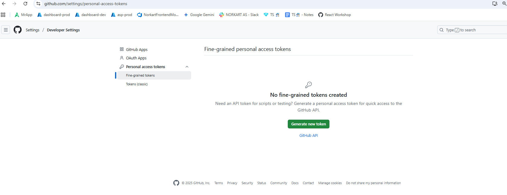

# Velkommen til kurs med Norkart!

Vi gir dere en enkel boilerplate på en react-applikasjon med mapbox kart og forklarer hvordan denne kan deployes til github pages. Videre kan dere:

- sette opp automatisk utrulling ved bruk av github actions.
- utvikle mer funksjonalitet i appen.

Det blir også konkuranse. Det er pris for

1. Første person / gruppe til å sende en fungerende github pages lenke med boilderplate appen (sendes til kari.meling.johannessen@norkart.no)
2. Juriens choice - Lag noe kult.

Lykke til!

---

## STEG 0: Forutsetninger

Før dere starter må dere ha noe programvare installert:

1. **Git**. Følg instruksjonene som gjelder for ditt OS her: https://git-scm.com/book/en/v2/Getting-Started-Installing-Git. Sjekk at git er installert:

```
   git --version
```

2. **Github**. Lag deg en bruker her https://github.com/

3. **Node.js med npm**. Det anbefales å bruke node version manager for å installere node siden dette lar deg enkelt bytte mellom node versjoner. For **Windows**: https://docs.microsoft.com/en-us/windows/nodejs/setup-on-windows. For **Mac/Linux**:
   https://www.stanleyulili.com/node/how-to-install-node-and-npm-on-mac-or-linux/. Sjekk at node og npm er installert:

```
   node --version
```

```
    npm --version
```

4. **En code editor (vs code anbefales)**. https://code.visualstudio.com/download

---

## STEG 1: Fork, clone og kjør prosjektet

1. For å få din egen versjon av prosjektet under egen github-bruker fork'er du dette prosjektet. Dette gjøres ved å trykke `fork` oppe i høyre hjørnet.
   Behold default innstillinger.

2. I terminalen. Finn fram til fillokasjonen hvor dere vil lagre prosjektet og klon repoet (deres egen versjon av prosjektet som dere nettop forket):

```
   git clone https://github.com/{{YOUR_GITHUB_USERNAME}}/norkart-webkurs-CICD-React.git
```

3. Gå inn i mappen du nettop klonet:

```
 cd norkart-webkurs-CICD-React/
```

4. Installer npm pakkene til prosjektet. De relevante pakkene kan sees i `package.json` filen i prosjektet. Vi bruker for eksempel `mapbox-gl` biblioteket til å vise kart på nettsiden. Dette vil i tillegg installere `gh-pages` som brukes til å deploye nettsiden.

```
   npm install
```

5. Kjør opp prosjektet lokalt:

```
   npm start
```

Dette bør åpne browseren din på https://localhost:3000/react-bedpress.

HURRA! Du kan nå kalle deg for en React-utvikler!

---

## STEG 2: Få nettsiden til å kjøre på github-pages.

1. Åpne prosjektet i vs code. (skriv `code .` i terminalen )
2. Endre homepage i `package.json` til din egen url: `"homepage": "https://{{YOUR_GITHUB_USERNAME}}.github.io/norkart-webkurs-CICD-React",`
   

3. Aktiver github actions i repoet ditt.


4. Deploy appen til github pages:

```
   npm run deploy
```

Denne kommandoen vil lage en branch i repoet ditt som heter gh-pages. Du kan kjøre denne kommandoen siden kildekoden har definert den i scripts i package.json. I tillegg, har du allerede installert pakken `gh-pages` når du kjørte kommandoen `npm install`.


5. Sjekk at github action 'pages-build-deployment' kjører


6. Når github action er ferdig - sjekk om nettsiden din kjører på: `https://{{YOUR_GITHUB_USERNAME}}.github.io/norkart-webkurs-CICD-React/`

Hurra! nettsiden din er live :D

## STEG 3: Automatisk deploy med github actions

For å oppdattere nettsiden må vi manuelt kjøre **npm run deploy** etter å ha endret koden. Hadde det ikke vært greit å automatisert dette slik at nettsiden oppdatteres hver gang main-branchen oppdateres? Dette kan vi gjøre ved hjelp av Github Actions:

1. Generer access token for å deploye nettsiden gjennom Github Actions

For å gi Github Actions tilgang til å lese og deploye repoet vårt, trenger vi ett access token. Gå til https://github.com/settings/tokens og trykk 'Generate new token'.
<br>
<br>



<br>
<br>

Gi tokenet et navn, f.eks 'deploy-access', og huk av på 'repo'. Klikk så på 'Generate token' og kopier verdien.


<br>
<br>
<br>

2. Lag en secret som kan brukes av Github Actions

For å la Github Actions hente tokenet vi nettop lagde, trenger vi en sectet. Trykk på 'New Secret'. Gi den navn: 'ACTIONS_DEPLOY_ACCESS_TOKEN', og verdi: tokenet du kopierte fra forrige steg.
<br >
<br >
<br >

<br>
<br>
<br>

3. Gjør endring i appen og push til main branchen. Dette skal trigge en github action (se '.github\workflows\main.yml' ) som automatisk kjører `npm run deploy`. Når denne actionen er ferdig, skal dette trigge pages-build-deployment workflowen og endringene skal automatisk rulles ut til nettsiden din.

## STEG 4: Utvikle en super cool react-app med continuous deployment!

1. Gjør endringer i koden (start for eksempel med å oppdatere kartets zoom nivå, start koordinater eller bakgrunnskart).
2. Push oppdateringene dine til git og deploy endringene

```
git add .
git commit -m 'Your commit message'
git push origin main
```

Endringene du gjør vil automatisk oppdateres på nettsiden din! Happy coding :D
Nå står du fritt til å gjøre noe det du vil med appen, mulige utfordringer:

## OPTION 1: Bytt bakgrunnskart

I dette steget skal du lage en enkel meny for å bytte bakgrunnskartet. Mapbox dokumentasjonen forklarer hvordan det kan gjøres med html og javascript: https://docs.mapbox.com/mapbox-gl-js/example/setstyle/. Med noen få tweeks, kan du få til det samme i din React applikasjon. Her får du noen tips til hvordan å løse oppgaven. Spør gjerne om hjelp hvis du sitter fast.


De forskjellige bakgrunnene som finnes har følgende ider: "streets-v11", "light-v10", "dark-v10" og "satellite-v9". Bakgrunnskartet endres ved et kall til `map.setStyle('mapbox://styles/mapbox/${layerId}')`.

For å lage denne komponenten kan man ta utgangspunkt i oppsettet som ligger i LocationMenu.

## OPTION 2: Tegn og Hent Ut Koordinater I Kart

Importerer dere komponenten "DrawComponent" lages det en liten meny. Trykker dere på firkanten kan dere tegne et polygon i kartet, søppelkassa sletter tegningen. Oppgaven her går ut på å lage støtte for å hente ut koordinatene til figuren som tegnes. Videre kan dere regne ut omkretsen/arealet av figuren.

Anbefaler å ta en titt på eksempelet her: https://docs.mapbox.com/mapbox-gl-js/example/mapbox-gl-draw/ (OBS eksempelet bruker et bibliotek som heter turf for å regne ut arealet av figuren, denne kan importeres ved å inkludere "import \* as turf from '@turf/turf" i toppen av fila du skal bruke biblioteket i).

MapBox har en masse andre funksjoner for å gjøre tegning i kart. Dokumentasjon på dette finner dere her: https://github.com/mapbox/mapbox-gl-draw/blob/main/docs/API.md

## OPTION 3: Fly Til Adresse

I denne oppgaven skal du lage støtte for å kunne søke opp en vilkårlig adresse i Norge og deretter flytte kartvisningen til denne adressen. Til denne oppgaven har dere fått ett verktøy komponenten AdresseBoks benytter seg av en søkemotor som tar inn en adresse og gir geografiske koordinater (Latitude/Longitude) tilbake. Det anbefales å importere denne komponenten og prøve den litt for å forstå hvordan oppgaven kan løses. \*Hint komponenten LocationsMenu kan også gi inspirasjon.

## OPTION 4: Gjør Noe Annet Kult

Her kan man gjøre noe helt annet eller noe som bygger på oppgavene over. Dette er gjerne oppgave man starter på dersom man er godt kjent med React eller er blitt ferdig med en av de andre oppgavene over. Forslag kan være å bygge på en av de tidligere oppgavene man har fullført, prøve å kombinere noen oppgaver eller finne på noe helt annet.

Tips til andre ting du kan gjøre med kartet:

- Sjekk ut mapbox gl sine eksempler: https://docs.mapbox.com/mapbox-gl-js/example/
- Visualisere historiske Oslo bysykkel data: https://oslobysykkel.no/en/open-data/historical
- Lag et Koropletkart av Norgesbefolkning. En Json fil er lagt ved (se sample_data folderen) som viser norges befolkning delt opp i 5x5km ruter.
- Visualiser din egen data. Du kan lage geojson filer her: https://geojson.io/#map=2/20.0/0.0

### NB

- Mapbox tokenet til dette prosjektet vil utløpe etter et par uker. Du kan enkelt lage din egen token på https://account.mapbox.com/access-tokens. Det er gratis helt frem til du får veldig stor traffikk mot appen din. Bytt ut tokenen din i,'.env' filen for å ta i bruk din egen token. Det annbefales ikke å legge tokenet i kode på et public github repo (bruk private eller la være å pushe .env fila til git). I Mapbox Studio kan du også lage custom kart (f.eks dark mode med rosa vann) som du kan vise på nettsiden.

- Fritekstsøk Api nøkkelen vil også deaktiveres. Du kan få tak din egen nøkkel til testing her: https://developer.norkart.no/


